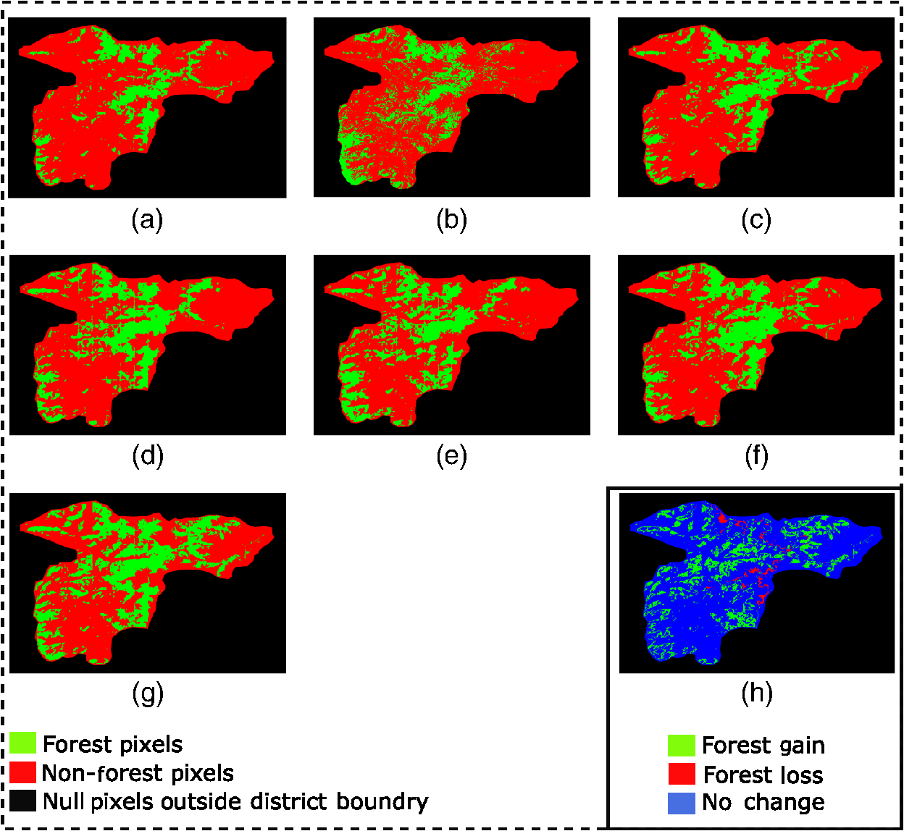
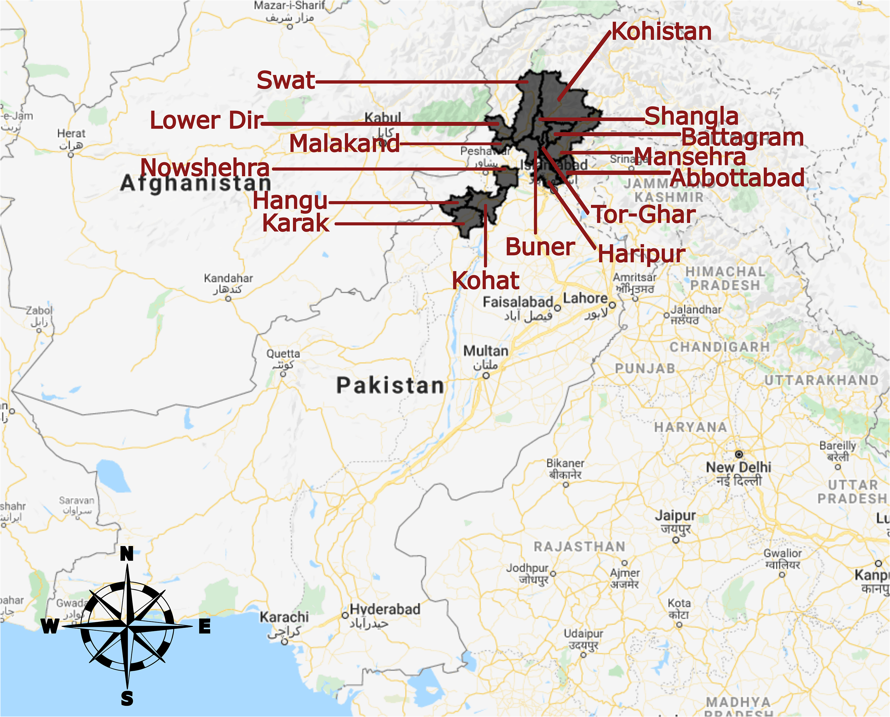
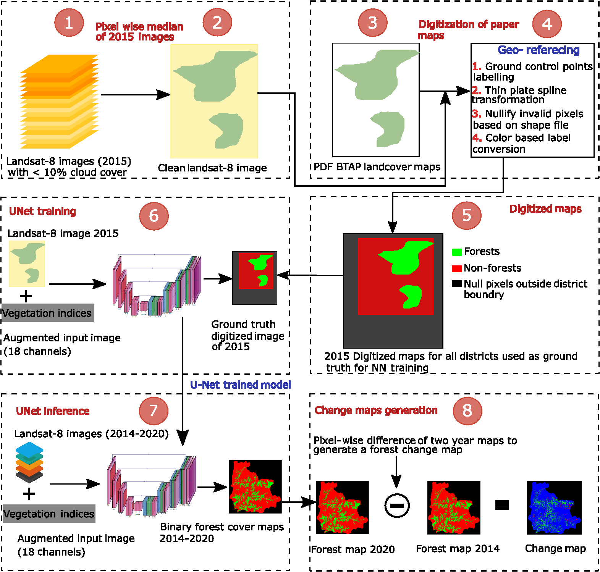
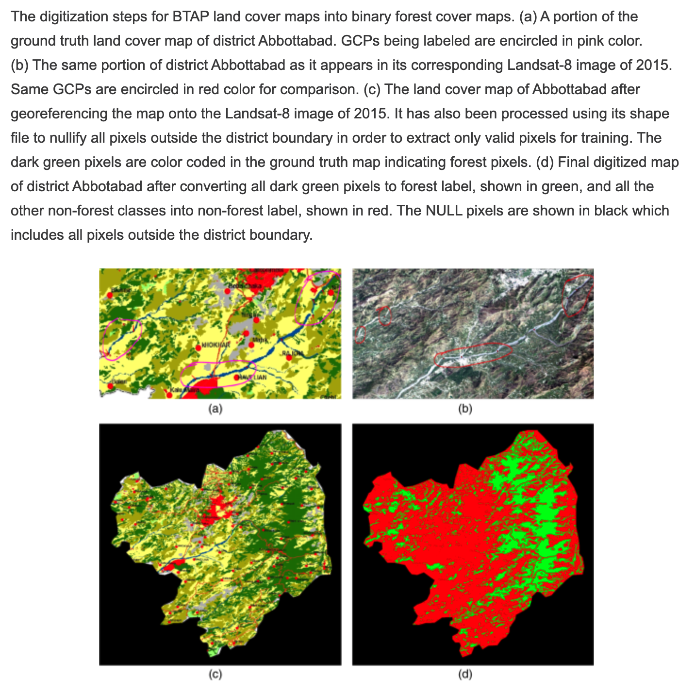

# AI-ForestWatch
The aim of this project is to use Landsat-8 imagery to perform forest cover change detection in the Billion Tree Tsunami Afforestation Regions in Pakistan. We do binary land cover segmentation of an image into forest/non-forest classes for our Areas of Interest (AOI), then repeat the same for a whole 7-year temporal series of images from 2014 to 2020 and lastly, compare them to see what forestation changes occured in selected areas. The selected image below shows our results for Battagram district from 2014 to 2020, where red pixels are non-forest labels, green pixels are forest labels and the last image shows overall gain/loss map from 2014 to 2020.

<p align='center'>
    
</p>

Our paper contains much more detailed explanation of our methodology, dataset retrieval and preparation, Machine Learning application, model design and band combinations used in our experiments. PDF of the paper is available as `jars-spie-accepted-work.pdf` in the main repository and it may be accessed [online](https://www.spiedigitallibrary.org/journals/journal-of-applied-remote-sensing/volume-15/issue-02/024518/AI-ForestWatch--semantic-segmentation-based-end-to-end-framework/10.1117/1.JRS.15.024518.full) at JARS website.


## What is this all about?
We analyse the following labelled regions in Pakistan from 2014 to 2020.
<p align='center'>
    
</p>
Essentially, we extract a per-pixel median image representative of a full year for every given region from Landsat-8. This is done in order to minimize effect of clouds and other weather sensitivities in the results. Google Earth Engine was heavily utilized for the retrieval and preprocessing of data. The pipeline including the preprocessing and there onwards is summarized in the following diagram.
<p align='center'>
    
</p>
Step-(1) to step-(5) depict the digitization process of the available 2015 ground truth maps that we use for training. Step-(6) shows the UNet model used as our per-pixel classifier and the step-(7) and step-(8) show the generation of forest estimation and change detection, respectively.
The available land cover maps are for the year 2015 only, so we digitize them using QGIS. We georeference the maps onto actual satellite images from Landsat-8 and use distinct visual features for Ground Control Point (GCP) selection. The steps involved are summarized below.
<p align='center'>
    
</p>
We use a UNet segmentation model to make per-pixel classification decisions to segment satellite images into forest/non-forest pixels. The results are binary maps with forest and non-forest pixels, with additional invalid bits that define regions outside of the district boundaries (which are present since images are rectangles but actual district boundaries might be any arbitrary shape). Once we learn to segment images in 2015 tests, we run the same model to infer on the images from 2014, 2016, 2017, 2018, 2019 and 2020. This gives us temporal series of forest cover maps that can be compared to deduce forest cover change statistics as we demonstrate in our paper.

## Getting Started with Code

All of the models in this repo are written with [pytorch](https://github.com/pytorch/pytorch).

### Dependencies

You will need the following modules to get the code running

* [pytorch](https://github.com/pytorch/pytorch)
* [torchsummary](https://github.com/sksq96/pytorch-summary)
* [torchviz](https://github.com/szagoruyko/pytorchviz)
* [gdal](https://pypi.org/project/GDAL/)
* [imgaug](https://github.com/aleju/imgaug)

### Project Hierarchy
`BTT-2020-GroundTruth` contains the ground truth labels (digitized maps) used as targets for our UNet model. Most of the training scripts are located in `LandCoverSegmentation/semantic_segmentation` directory. This directory also contains the data set generator script which divides the huge Satellite Images for the entire district into 256x256 tiles, zips their ground truth with them, and writes these blobs to drive. The path to the blobs directory is consumed by the training script. `inference_btt_2020.py` is the script used to run inference on a given test image using the trained model.

<!-- ```
cd path/to/ForestCoverChange/
python -m pipeline.detect --images path/to/folder/containing/images/ --model_type model_name --channels number_of_channels_depending_on_the_model --trained_model path/to/pretrained/model --bands list_of_bands_to_use --save_dir path/to/save/results/ --device cpu_or_gpu
```  -->
<!-- **For example,**
```
cd /home/annus/PycharmProjects/ForestCoverChange/
python -m pipeline.detect --images /home/annus/Desktop/13bands_european_image_time_series/ --model_type VGG_N --channels 3 --trained_model patch_classification/trained_models/vgg3.pt --bands 4 3 2 --save_dir temp-3 --device cpu
``` 
Both pretrained models VGG_3 and VGG_5 are available in `patch_classification/trained_models/` -->

<!-- ## Authors

* **Annus Zulfiqar**

See also the list of [contributors](https://github.com/annusgit/ForestCoverChange/graphs/contributors) who participated in this project.

## License

This project is licensed under the MIT License - see the [LICENSE.md](LICENSE) file for details

## Acknowledgments

* [Sentinel](https://scihub.copernicus.eu/) program for providing complete coverage of Earth for free
* [Eurosat](https://arxiv.org/pdf/1709.00029.pdf) for providing a labeled dataset
* [Pytorch Forum](http://discuss.pytorch.org/) for providing valuable help when needed -->


