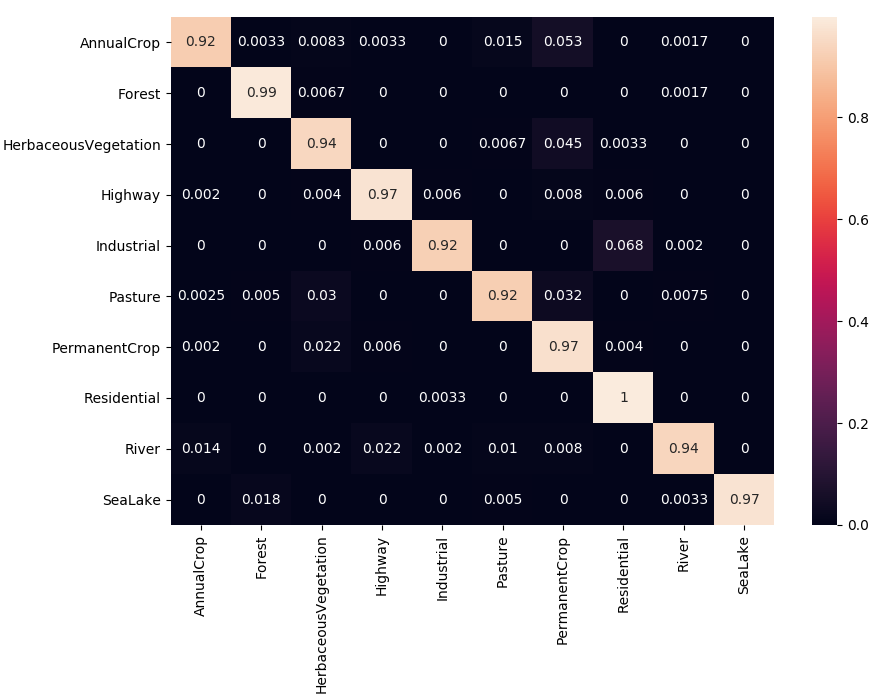

# Forest Cover Change Detection and Prediction over Pakistani Areas

The aim of this project is to use Sentinel and Landsat imagery in order to perform forest cover change detection in Pakistan. The first step is to segment an image from our AOI and then do the same for a whole temporal series of images and finally compare them to see what changes occured in forest areas. We also intend to predict forestation change trend in Pakistan.                                                                                      

## Getting Started

All of the models in this repo are written with [pytorch](https://github.com/pytorch/pytorch).

### Dependencies

You will need the following modules to get the code running

* [pytorch](https://github.com/pytorch/pytorch)
* [torchsummary](https://github.com/sksq96/pytorch-summary)
* [torchviz](https://github.com/szagoruyko/pytorchviz)
* [gdal](https://pypi.org/project/GDAL/)
* [imgaug](https://github.com/aleju/imgaug)

## Results

### Image Segmentation on ISPRS data set using UNet architecture.
[Vaihingen Dataset](http://www2.isprs.org/commissions/comm3/wg4/semantic-labeling.html) Segmentation after downsampling

### Patch-wise classification of Sentinel-2 Satellite Images.
We used the [Eurosat](https://arxiv.org/pdf/1709.00029.pdf) data set and a [Resnet-50](https://pytorch.org/docs/stable/torchvision/models.html#torchvision.models.resnet50) model for classifying 64*64 patches of image
Here is our Confusion Matrix on the test set

The following images show our results one different landscapes. It should be noted that these images were not a part of the training or test set. They were downloaded separately from [scihub](https://scihub.copernicus.eu) and [earthexplorer](http://earthexplorer.usgs.gov) for inference.  
- **Germany** 

- **Pakistan (Peshawar Region)** 

- **Pakistan (Muzaffarabad Region)** 

## Authors

* **Annus Zulfiqar**

See also the list of [contributors](https://github.com/annusgit/ForestCoverChange/graphs/contributors) who participated in this project.

## License

This project is licensed under the MIT License - see the [LICENSE.md](LICENSE) file for details

## Acknowledgments

* [Sentinel](https://scihub.copernicus.eu/) program for providing complete coverage of Earth for free
* [Eurosat](https://arxiv.org/pdf/1709.00029.pdf) for providing a labeled dataset
* [Pytorch Forum](http://discuss.pytorch.org/) for providing valuable help when needed

