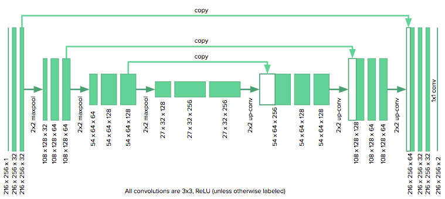
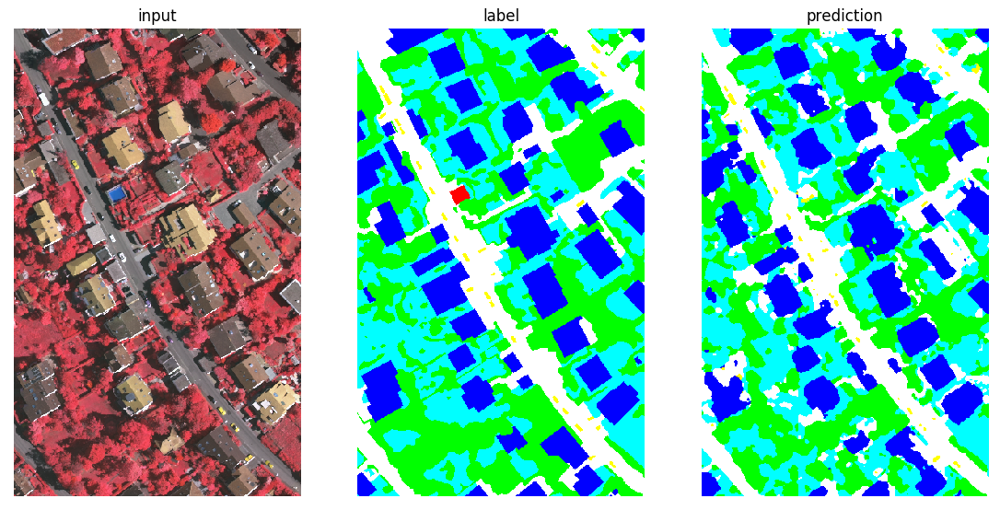
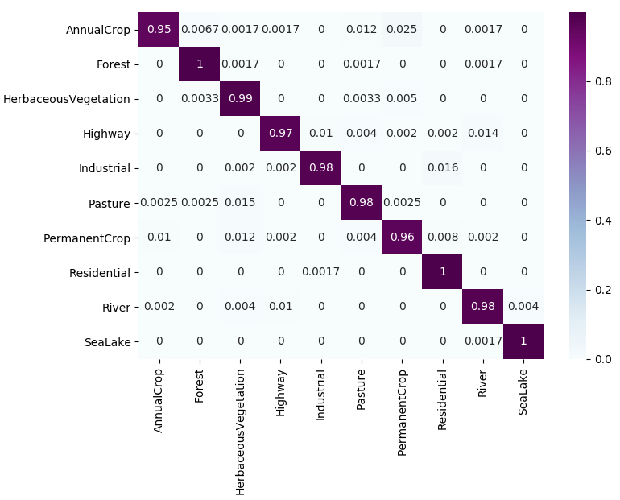
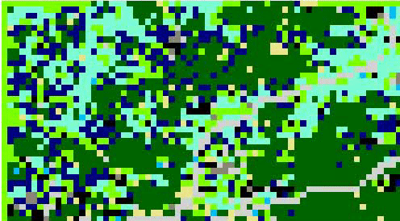
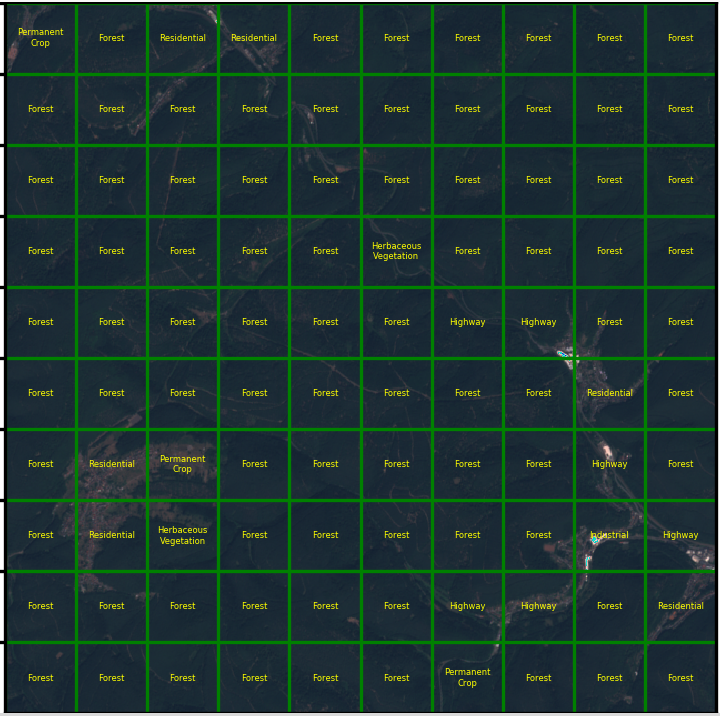
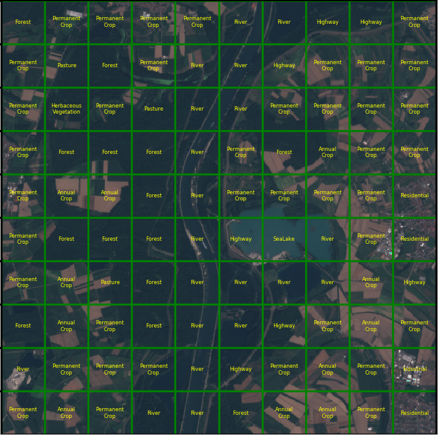
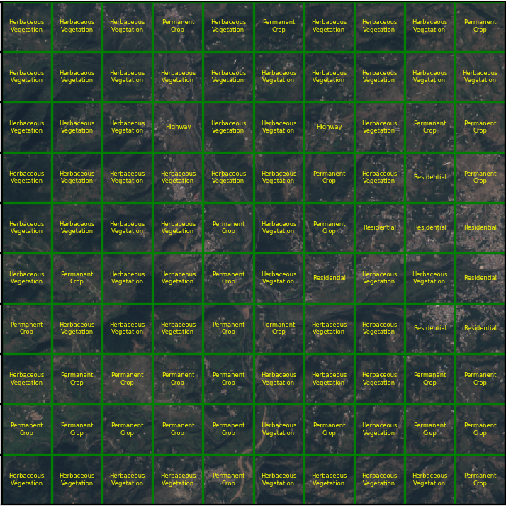

# Forest Cover Change Detection and Prediction over Pakistani Areas
<p align='center'>
    <!--  -->
    
</p>

The aim of this project is to use Sentinel and Landsat imagery in order to perform forest cover change detection in Pakistan. The first step is to segment an image from our AOI and then do the same for a whole temporal series of images and finally compare them to see what changes occured in forest areas. We also intend to predict forestation change trend in Pakistan.                                                                                      

## Getting Started

All of the models in this repo are written with [pytorch](https://github.com/pytorch/pytorch).

### Dependencies

You will need the following modules to get the code running

* [pytorch](https://github.com/pytorch/pytorch)
* [torchsummary](https://github.com/sksq96/pytorch-summary)
* [torchviz](https://github.com/szagoruyko/pytorchviz)
* [gdal](https://pypi.org/project/GDAL/)
* [imgaug](https://github.com/aleju/imgaug)


## Results

### Image Segmentation on ISPRS data set using UNet architecture.
**Unet Architecture** 
<p align='center'> 
    
</p>

**[Vaihingen Dataset](http://www2.isprs.org/commissions/comm3/wg4/semantic-labeling.html) Segmentation after downsampling**
<p align='center'> 
    
</p>

### Patch-wise classification of Sentinel-2 Satellite Images.
We used the [Eurosat](https://arxiv.org/pdf/1709.00029.pdf) data set and a two variants of VGG architecture for classifying 64*64 patches of image.
Here are the two confusion matrices, the left one is with 3 channels (96.38% acc. on the test set) and the right one is for 5 channels (98.05% acc. on the test set) at the input of the VGG.
<p align="center"> 
    
    
</p>

* The following images show our results one different landscapes. It should be noted that these images were not a part of the training or test set. They were downloaded separately from [scihub](https://scihub.copernicus.eu) and [earthexplorer](http://earthexplorer.usgs.gov) for inference.  

**`Change Detection on a series of Sentinel Images from German Landscapes (2016-2018)`**
<p align='center'> 
    
    
</p>

**`Same result but color coded in full resolution`**
<p align='center'> 
    
</p>


- **Germany**
<p align="center"> 
    
    
</p>

- **Pakistan (Peshawar Region)**
<p align="center"> 
    
    
</p>

- **Pakistan (Muzaffarabad Region)**
<p align="center"> 
    
    
</p>

# Usage
## Inference on custom sentinel images downloaded from [Sentinel](https://scihub.copernicus.eu/) or EarthExplorer.
```
cd location/of/ForestCoverChange/
python -m pipeline.detect --images path/to/folder/containing/images/ --model_type model_name --channels number_of_channels_depending_on_the_model --trained_model path/to/pretrained/model --bands list_of_bands_to_use --save_dir path/to/save/results/ --device cpu_or_gpu
``` 
**For example,**
```
cd /home/annus/PycharmProjects/ForestCoverChange/
python -m pipeline.detect --images /home/annus/Desktop/13bands_european_image_time_series/ --model_type VGG_N --channels 3 --trained_model patch_classification/trained_models/vgg3.pt --bands 4 3 2 --save_dir temp-3 --device cpu
``` 
Both pretrained models VGG_3 and VGG_5 are available in `patch_classification/trained_models/`

## Authors

* **Annus Zulfiqar**

See also the list of [contributors](https://github.com/annusgit/ForestCoverChange/graphs/contributors) who participated in this project.

## License

This project is licensed under the MIT License - see the [LICENSE.md](LICENSE) file for details

## Acknowledgments

* [Sentinel](https://scihub.copernicus.eu/) program for providing complete coverage of Earth for free
* [Eurosat](https://arxiv.org/pdf/1709.00029.pdf) for providing a labeled dataset
* [Pytorch Forum](http://discuss.pytorch.org/) for providing valuable help when needed


